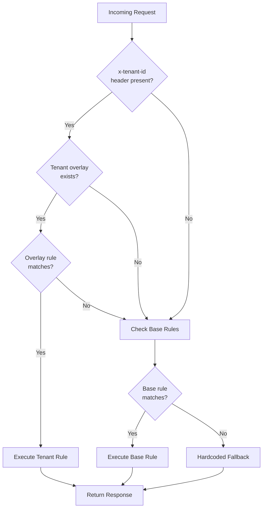
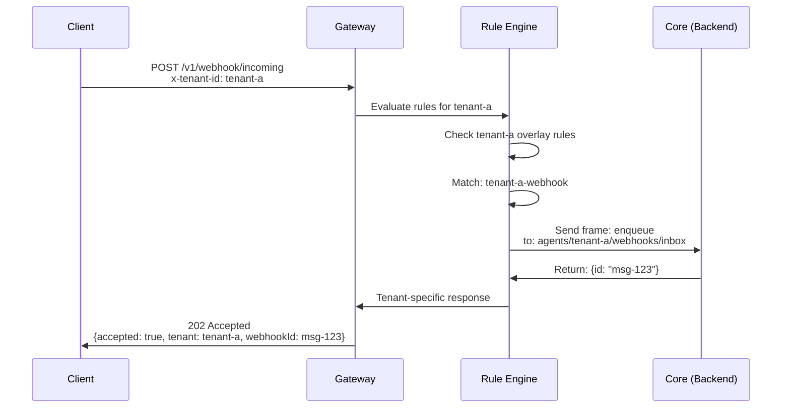
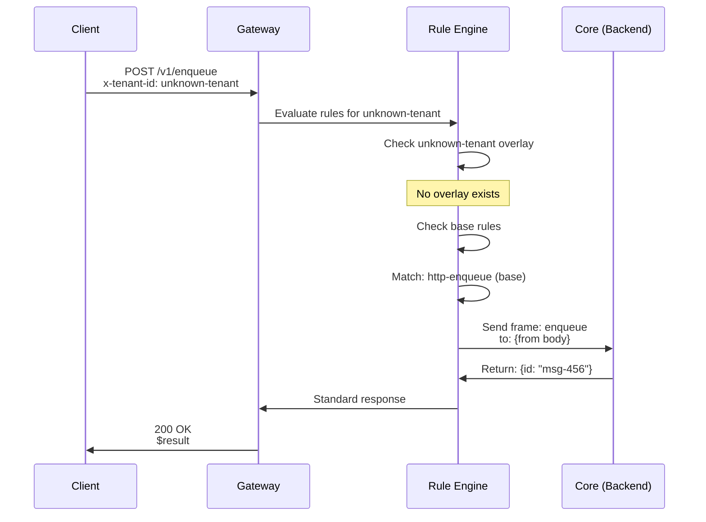
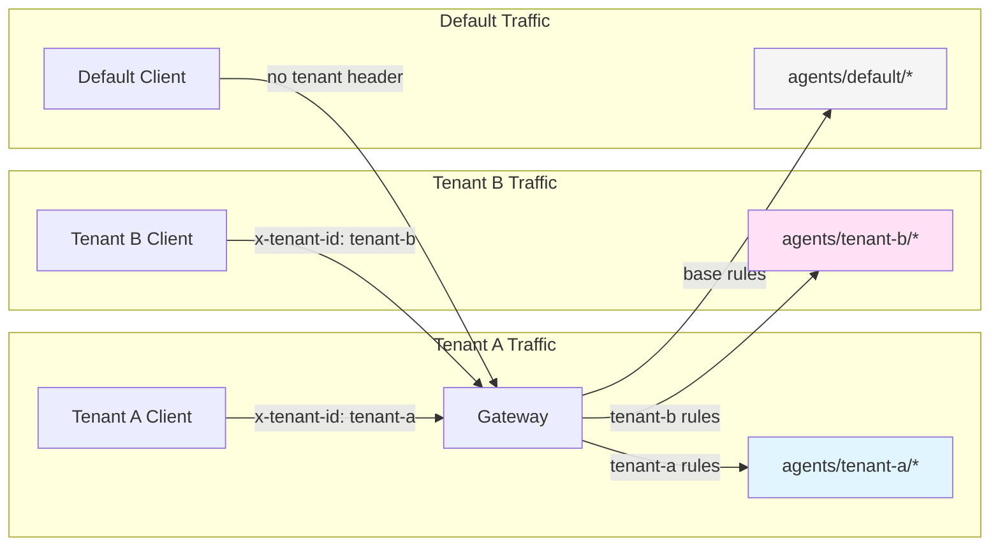

# T5062: Tenant Overlay Flow Diagram

## Request Evaluation Flow



## Example: Tenant A Webhook Request



## Example: Unknown Tenant Fallback



## Tenant Isolation Pattern



## Configuration Structure

```
rules.yaml
├── version: proto-dsl/v0
├── defaults:
│   └── onError: { ... }
├── rules:                     ← Base rules (all tenants)
│   ├── health-check
│   ├── http-enqueue
│   ├── http-stats
│   └── ...
└── tenantOverlays:            ← Per-tenant customization
    ├── tenant-a:
    │   └── rules:
    │       ├── tenant-a-webhook
    │       └── tenant-a-secure-enqueue
    ├── tenant-b:
    │   └── rules:
    │       ├── tenant-b-priority-enqueue
    │       └── tenant-b-snapshot
    └── tenant-c:
        └── rules:
            └── tenant-c-subscribe
```

## Rule Priority Matrix

| Request Type | x-tenant-id | Overlay Exists | Overlay Match | Base Match | Result |
|--------------|-------------|----------------|---------------|------------|--------|
| POST /v1/webhook | tenant-a | ✅ Yes | ✅ Yes | N/A | **Tenant Rule** |
| POST /v1/webhook | tenant-a | ✅ Yes | ❌ No | ✅ Yes | **Base Rule** |
| POST /v1/webhook | tenant-a | ✅ Yes | ❌ No | ❌ No | **Hardcoded** |
| POST /v1/webhook | unknown | ❌ No | N/A | ✅ Yes | **Base Rule** |
| POST /v1/webhook | (none) | N/A | N/A | ✅ Yes | **Base Rule** |
| POST /v1/enqueue | tenant-a | ✅ Yes | ✅ Yes | N/A | **Tenant Rule** (with auth) |
| POST /v1/enqueue | tenant-b | ✅ Yes | ❌ No | ✅ Yes | **Base Rule** (no auth) |

## Stream Routing Pattern

```
Base Rule:
POST /v1/enqueue → agents/{from-body}/inbox

Tenant A Overlay:
POST /v1/enqueue (x-tenant-id: tenant-a) → agents/tenant-a/{from-body}

Tenant B Priority:
POST /v1/priority/enqueue (x-tenant-id: tenant-b) → agents/tenant-b/priority/{from-body}

Result:
┌─────────────────┬──────────────────┬────────────────────────────────┐
│ Tenant          │ Endpoint         │ Stream                         │
├─────────────────┼──────────────────┼────────────────────────────────┤
│ (none)          │ /v1/enqueue      │ agents/{body.to}               │
│ tenant-a        │ /v1/enqueue      │ agents/tenant-a/{body.to}      │
│ tenant-b        │ /v1/enqueue      │ agents/{body.to} (fallback)    │
│ tenant-b        │ /v1/priority/... │ agents/tenant-b/priority/...   │
│ unknown-tenant  │ /v1/enqueue      │ agents/{body.to} (fallback)    │
└─────────────────┴──────────────────┴────────────────────────────────┘
```

## Performance Characteristics

```
Request Processing Time Breakdown:

No Tenant Header:
├─ Parse request: 0.05ms
├─ Match base rule: 0.10ms
└─ Execute handler: 0.50ms
TOTAL: ~0.65ms

With Tenant Header (match in overlay):
├─ Parse request: 0.05ms
├─ Tenant lookup: 0.01ms
├─ Match overlay rule: 0.10ms
└─ Execute handler: 0.50ms
TOTAL: ~0.66ms (+0.01ms overhead)

With Tenant Header (fallback to base):
├─ Parse request: 0.05ms
├─ Tenant lookup: 0.01ms
├─ Check overlay rules: 0.10ms
├─ Match base rule: 0.10ms
└─ Execute handler: 0.50ms
TOTAL: ~0.76ms (+0.11ms overhead)

Overhead: 0.01ms (match) to 0.11ms (fallback)
Impact: <1% for typical request handling
```

## Security Model

```
┌──────────────────────────────────────────────────────────┐
│ Security Layers                                          │
├──────────────────────────────────────────────────────────┤
│ 1. Tenant Identification (T5061)                         │
│    └─ Extract x-tenant-id from validated source          │
│       (JWT claim, API key, TLS cert)                     │
│                                                          │
│ 2. Tenant Validation (T5062)                             │
│    └─ Require x-tenant-id in overlay rule matchers      │
│       when: { headers: { x-tenant-id: tenant-a } }       │
│                                                          │
│ 3. Stream Namespacing (T5062)                            │
│    └─ Prefix all streams with tenant ID                 │
│       to: agents/{tenant-id}/{stream}                    │
│                                                          │
│ 4. Authorization (Application Layer)                     │
│    └─ Validate tenant permissions at core service       │
└──────────────────────────────────────────────────────────┘

Example Flow:
┌─────────┐     ┌──────────┐     ┌───────┐     ┌──────┐
│ Client  │────▶│ Gateway  │────▶│ Rules │────▶│ Core │
│ (JWT)   │     │ (T5061)  │     │(T5062)│     │(Auth)│
└─────────┘     └──────────┘     └───────┘     └──────┘
    │                │                │             │
    │                │                │             │
    │  JWT with      │  x-tenant-id:  │  Stream:    │  Verify:
    │  tenant claim  │  tenant-a      │  agents/    │  JWT + 
    │                │  (extracted)   │  tenant-a/* │  tenant
```

## Deployment Patterns

### Pattern 1: Single Instance, Multiple Tenants
```
┌────────────────────────────────────────┐
│ Conduit Instance                       │
│ ┌────────────────────────────────────┐ │
│ │ rules.yaml                         │ │
│ │ ├─ base rules                      │ │
│ │ └─ tenantOverlays:                 │ │
│ │    ├─ tenant-a (5 rules)           │ │
│ │    ├─ tenant-b (3 rules)           │ │
│ │    └─ tenant-c (4 rules)           │ │
│ └────────────────────────────────────┘ │
└────────────────────────────────────────┘
          │
          ├─────▶ Backend (shared)
          
Use when: Tenants OK with shared infrastructure
Memory: +50KB for 100 tenants
Overhead: +0.1ms per request
```

### Pattern 2: Separate Instances, Per Tenant
```
┌─────────────┐  ┌─────────────┐  ┌─────────────┐
│ Conduit-A   │  │ Conduit-B   │  │ Conduit-C   │
│ (tenant-a)  │  │ (tenant-b)  │  │ (tenant-c)  │
└─────────────┘  └─────────────┘  └─────────────┘
      │                │                │
      ├────────────────┼────────────────┤
      │          Backend (isolated)     │
      
Use when: Complete isolation required
Memory: No overlay overhead
Overhead: None
Cost: Higher (multiple instances)
```

### Pattern 3: Hybrid (Base + High-Value Tenants)
```
┌────────────────────────────────────────┐
│ Conduit Shared                         │
│ ├─ base rules                          │
│ └─ tenantOverlays:                     │
│    ├─ standard-tier-a                  │
│    └─ standard-tier-b                  │
└────────────────────────────────────────┘
          │
          ▼
    Backend (shared)

┌─────────────┐  ┌─────────────┐
│ Conduit-E1  │  │ Conduit-E2  │
│ (enterprise)│  │ (gov)       │
└─────────────┘  └─────────────┘
      │                │
      ▼                ▼
  Backend-E1      Backend-Gov
  (isolated)      (isolated)

Use when: Mix of shared + isolated tenants
Optimizes: Cost vs. isolation tradeoff
```

---

**Visual documentation for T5062 overlay mechanism**
