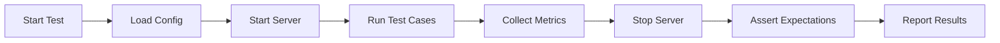

# Conduit Testing Plan (Stage 2)

## Executive Summary

This document defines the comprehensive testing strategy for Conduit's DSL-driven architecture, covering correctness, performance, safety, and operational reliability.

**Testing Philosophy**: Every DSL rule must be provably correct, every adapter must preserve protocol semantics, and the system must gracefully handle edge cases under load.

---

## 1. Scope

### What We're Testing

1. **DSL Interpreter Correctness**
   - Rule matching (`when` conditions: method, path, headers, query, WebSocket message matchers)
   - Field extraction and mapping (`map`, selectors: `$body`, `$query`, `$headers`, `$message`)
   - Frame construction (enqueue, subscribe, grant, ack, nack, stats, snapshot, metrics)
   - Error handling (`onError` mappings to HTTP/WS responses)
   - Combinators (`all`, `any`, `not`)

2. **HTTP Adapter Bidirectionality**
   - Request → Frame: HTTP methods/paths/bodies → control frames
   - Frame → Response: Control protocol results → HTTP status codes + JSON bodies
   - Content types: `application/json`, `text/plain`, `application/octet-stream`
   - Headers: request headers, response headers, custom mappings

3. **WebSocket Adapter Bidirectionality**
   - Connection → Subscribe: WS open + query params → subscribe frame
   - Message → Frame: JSON messages → grant/ack/nack frames
   - Frame → Message: Deliver frames → outbound WS messages
   - Error → Close: Error codes → WS close codes (1003, 1007, 1008, 1011)
   - Flow control: Credit grant windows, backpressure handling

4. **Performance Under Load**
   - Small message throughput (32-256 byte payloads)
   - Latency distribution (p50, p95, p99)
   - Concurrent connection handling
   - Memory stability over time

5. **Safety and Edge Cases**
   - Large payloads (100MB HTTP upload)
   - Malformed JSON and invalid inputs
   - Timeout handling (slow clients, stalled connections)
   - Resource exhaustion protection (max connections, buffer limits)
   - Security: Unauthorized access, injection attempts

---

## 2. Test Types

### 2.1 Unit Tests (DSL Rules)

**Purpose**: Verify individual DSL rules match correctly and produce expected frames.

**Coverage**:
- `when.http` matchers:
  - Exact method match: `method: POST`
  - Multiple methods: `method: [GET, POST]`
  - Path wildcards: `/v1/streams/*`
  - Query param exact match: `query.stream: "test/stream"`
  - Header match: `headers.authorization: "Bearer token"`
- `when.ws` matchers:
  - Connection path: `path: /v1/subscribe`
  - Message field presence: `json.has: credit`
  - Message field value: `json.match: {type: subscribe}`
- Combinators:
  - `all`: AND logic
  - `any`: OR logic
  - `not`: Negation
- Field extraction:
  - Simple: `$body.to`, `$query.stream`
  - Nested: `$body.envelope.id`, `$result.streams[0].id`
  - Fallbacks: `$body.priority || "normal"`

**Test Files**:
- `tests/dsl_matching.test.ts` - Rule matching logic
- `tests/dsl_selectors.test.ts` - Field extraction
- `tests/dsl_errors.test.ts` - Error mapping

**Success Criteria**: 100% DSL rule coverage, all edge cases documented.

---

### 2.2 Integration Tests (HTTP)

**Purpose**: Verify HTTP adapter translates requests to frames and frames to responses.

**Test Matrix**:

| Endpoint | Method | Frame Type | Test Scenario | Expected Response |
|----------|--------|------------|---------------|-------------------|
| `/health` | GET | - | Health check | 200 OK, `{ok: true}` |
| `/v1/enqueue` | POST | enqueue | Valid message | 200, `{id: "..."}` |
| `/v1/enqueue` | POST | enqueue | Missing `to` field | 400, `InvalidEnvelope` |
| `/v1/enqueue` | POST | enqueue | Invalid JSON | 400, `InvalidJSON` |
| `/v1/enqueue` | POST | enqueue | Unknown stream | 404, `UnknownStream` |
| `/v1/stats` | GET | stats | Valid stream | 200, `{depth, inflight}` |
| `/v1/stats` | GET | stats | Unknown stream | 404, `UnknownStream` |
| `/v1/snapshot` | GET | snapshot | Valid view | 200, view data |
| `/v1/snapshot` | GET | snapshot | Unknown view | 404, `UnknownView` |
| `/v1/metrics` | GET | metrics | System metrics | 200, `{streams: [...]}` |
| `/v1/custom` | POST | enqueue | Custom DSL rule | 202, custom response |

**Test Files**:
- `tests/http_bidir.test.ts` - Request/response round-trips
- `tests/http_errors.test.ts` - Error handling (400, 404, 429, 500, 504)
- `tests/http_mime.test.ts` - Content-type handling

**Success Criteria**: All default endpoints + 5 custom DSL rules tested, 100% error code coverage.

---

### 2.3 Integration Tests (WebSocket)

**Purpose**: Verify WebSocket adapter translates connections/messages to frames and frames to messages.

**Test Matrix**:

| Trigger | Frame Type | Test Scenario | Expected Behavior |
|---------|------------|---------------|-------------------|
| WS open `/v1/subscribe?stream=test` | subscribe | Valid subscription | Ack message, connection stays open |
| WS open `/v1/subscribe` | subscribe | Missing `stream` param | Close 1008 "Stream required" |
| WS message `{credit: 10}` | grant | Issue credit | Ack message `{granted: 10}` |
| WS message `{ack: "msg-123"}` | ack | Acknowledge message | Ack message `{acked: "msg-123"}` |
| WS message `{nack: "msg-456", delayMs: 5000}` | nack | Negative ack | Ack message `{nacked: "msg-456"}` |
| WS message `{invalid}` | - | Invalid JSON | Close 1007 "InvalidJSON" |
| WS message (no matching rule) | - | Unknown operation | Close 1003 "UnknownOp" |
| Deliver frame → client | - | Push message | Client receives JSON message |
| Error frame → client | - | Internal error | Close 1011 "Internal" |

**Test Files**:
- `tests/ws_bidir.test.ts` - Subscribe, grant, ack/nack flows
- `tests/ws_flow_control.test.ts` - Backpressure and credit windows
- `tests/ws_errors.test.ts` - Close codes and error handling

**Success Criteria**: All WS matchers + flow control + 100% error close code coverage.

---

### 2.4 Performance Tests

**Purpose**: Ensure system meets throughput and latency targets under load.

**Performance Targets**:

| Metric | Target | Measurement |
|--------|--------|-------------|
| Small message throughput (32-256 bytes) | >1,000 req/s | 100,000 POST /v1/enqueue requests |
| HTTP p50 latency | <5ms | 100,000 requests, concurrent |
| HTTP p95 latency | <10ms | 100,000 requests, concurrent |
| HTTP p99 latency | <20ms | 100,000 requests, concurrent |
| WS message throughput | >5,000 msg/s | 100,000 WS messages, 10 concurrent connections |
| WS deliver latency (p95) | <15ms | Enqueue → deliver round-trip |
| Concurrent connections | >100 | 100 active WS connections |
| Memory stability | <200MB RSS | 1M messages processed, no leaks |

**Test Scenarios**:
1. **Small Message Load**: 100k POST requests (32-256 byte payloads), measure throughput and latency distribution
2. **WS Streaming Load**: 10 concurrent WS connections, 10k messages each, measure delivery latency
3. **Concurrent Connections**: 100 simultaneous WS connections, verify server remains responsive
4. **Sustained Load**: 1M messages over 10 minutes, monitor memory growth

**Test Files**:
- `tests/perf_small.test.ts` - Small message load test
- `tests/perf_ws_concurrent.test.ts` - Concurrent WebSocket connections
- `tests/perf_sustained.test.ts` - Long-running stability test

**Success Criteria**: Meet all targets, memory stable within ±10% after warmup.

---

### 2.5 Safety & Edge Case Tests

**Purpose**: Verify system handles extreme inputs and adversarial scenarios.

**Safety Scenarios**:

| Scenario | Test | Expected Behavior |
|----------|------|-------------------|
| **Large payload (100MB)** | POST 100MB file to `/v1/upload` | Stream to sink, server responds, memory stays bounded |
| **Malformed JSON** | POST invalid JSON to `/v1/enqueue` | 400 InvalidJSON, connection stays alive |
| **Missing required fields** | POST `{}` to `/v1/enqueue` | 400 InvalidEnvelope |
| **Unknown stream** | POST to non-existent stream | 404 UnknownStream |
| **Unknown view** | GET non-existent view | 404 UnknownView |
| **Slow client (HTTP)** | Stalled upload >30s | 504 Timeout, connection closed |
| **Slow client (WS)** | No credit granted, 1000 messages queued | Backpressure, no unbounded buffers |
| **WS close without ack** | Client disconnects mid-message | Messages redelivered on reconnect |
| **Unauthorized access** | POST without auth header | 401 Unauthorized |
| **Rate limiting** | >100 req/s from single IP | 429 Backpressure, `retry-after` header |
| **Resource exhaustion** | Open 1000 connections | Graceful degradation, error after max |
| **Path traversal** | GET `../../etc/passwd` | 404 or 400, no file access |
| **Header injection** | Custom headers with newlines | Sanitized or rejected |

**Test Files**:
- `tests/large_payload.test.ts` - 100MB upload
- `tests/safety_malformed.test.ts` - Invalid inputs
- `tests/safety_timeouts.test.ts` - Slow client scenarios
- `tests/safety_limits.test.ts` - Resource exhaustion
- `tests/safety_security.test.ts` - Injection and auth

**Success Criteria**: No crashes, no memory leaks, all limits enforced, security boundaries intact.

---

## 3. Test Matrix (Comprehensive)

### HTTP Endpoints × Scenarios

| Endpoint | Valid | Invalid JSON | Missing Field | Unknown Resource | Timeout | Auth Fail |
|----------|-------|--------------|---------------|------------------|---------|-----------|
| `/health` | ✅ 200 | N/A | N/A | N/A | N/A | N/A |
| `/v1/enqueue` | ✅ 200 | ✅ 400 | ✅ 400 | ✅ 404 | ✅ 504 | ✅ 401 |
| `/v1/stats` | ✅ 200 | N/A | ✅ 400 | ✅ 404 | ✅ 504 | ✅ 401 |
| `/v1/snapshot` | ✅ 200 | N/A | ✅ 400 | ✅ 404 | ✅ 504 | ✅ 401 |
| `/v1/metrics` | ✅ 200 | N/A | N/A | N/A | N/A | ✅ 401 |

### WebSocket Matchers × Scenarios

| Matcher | Valid | Invalid JSON | Missing Field | Unknown Op | Close Early |
|---------|-------|--------------|---------------|------------|-------------|
| Connection `/v1/subscribe` | ✅ Subscribe | N/A | ✅ 1008 | N/A | ✅ Cleanup |
| Message `{credit}` | ✅ Grant | ✅ 1007 | ✅ 1003 | ✅ 1003 | ✅ Cleanup |
| Message `{ack}` | ✅ Ack | ✅ 1007 | ✅ 1003 | ✅ 1003 | ✅ Cleanup |
| Message `{nack}` | ✅ Nack | ✅ 1007 | ✅ 1003 | ✅ 1003 | ✅ Cleanup |

---

## 4. Tools & Test Harness

### 4.1 Test Infrastructure

**Harness Design** (`tests/harness.ts`):
- `startServer(config)`: Launch server with custom rules.yaml, return port
- `stopServer()`: Graceful shutdown, verify cleanup
- `httpRequest(method, path, body, headers)`: HTTP client helper
- `wsConnect(path, query)`: WebSocket client helper
- `wsSend(ws, message)`: Send JSON message
- `wsReceive(ws, timeout)`: Wait for message with timeout
- `measureLatency(fn)`: Timing wrapper
- `generatePayload(size)`: Random payload generator

**Utilities**:
- `scripts/gen-large-file.sh`: Generate test blobs (e.g., `./gen-large-file.sh 100MB`)
- `scripts/load-test.sh`: Parallel HTTP load generator
- `scripts/ws-load.sh`: Parallel WebSocket message generator

### 4.2 Test Commands

| Command | Description | File(s) Executed |
|---------|-------------|------------------|
| `npm run test:unit` | DSL matching and selectors | `tests/dsl_*.test.ts` |
| `npm run test:int` | HTTP/WS integration | `tests/http_*.test.ts`, `tests/ws_*.test.ts` |
| `npm run test:safety` | Edge cases and limits | `tests/safety_*.test.ts` |
| `npm run bench:small` | Small message load | `tests/perf_small.test.ts` |
| `npm run bench:large` | 100MB upload | `tests/large_payload.test.ts` |
| `npm run bench:ws` | WS concurrent load | `tests/perf_ws_concurrent.test.ts` |
| `npm run test:all` | Full test suite | All test files |

### 4.3 Test Execution Flow



**Example Test Structure**:
```typescript
// tests/http_bidir.test.ts
import { startServer, stopServer, httpRequest } from './harness';

const server = await startServer({ rules: 'config/rules.yaml' });

// Test: POST /v1/enqueue valid message
const res = await httpRequest('POST', '/v1/enqueue', {
  to: 'test/stream',
  envelope: { id: 'msg-1', type: 'test', payload: {} }
});
assert(res.status === 200);
assert(res.body.id);

// Test: POST /v1/enqueue invalid JSON
const res2 = await httpRequest('POST', '/v1/enqueue', 'not-json', {
  'content-type': 'application/json'
});
assert(res2.status === 400);
assert(res2.body.error === 'InvalidJSON');

await stopServer();
```

---

## 5. CI Strategy

### 5.1 CI Pipeline

**On Pull Request**:
- ✅ `npm run build` - TypeScript compilation
- ✅ `npm run test:unit` - DSL unit tests (fast, <10s)
- ✅ `npm run test:int` - HTTP/WS integration tests (fast, <30s)
- ⚠️ `npm run bench:small` - Basic performance smoke test (10k messages, <60s)

**On Merge to `main`**:
- ✅ Full test suite (`npm run test:all`)
- ✅ Full performance suite (`npm run bench:all`)
- ✅ Safety tests (`npm run test:safety`)
- 📊 Upload metrics artifacts (JSON/CSV)
- 📈 Compare with baseline (alert on >10% regression)

**Manual/Nightly**:
- 🔥 Load testing (1M+ messages)
- 🌪️ Chaos engineering (network faults, process kills)
- 🧪 Fuzz testing (random DSL configs, malformed inputs)

### 5.2 Artifact Collection

**Metrics Output**:
- `artifacts/perf-{timestamp}.json`: Latency histograms, throughput
- `artifacts/memory-{timestamp}.csv`: RSS over time
- `artifacts/errors-{timestamp}.log`: Error stack traces

**CI Uploads**: Minimal artifacts (<5MB), keep last 30 runs.

---

## 6. Success Criteria

### 6.1 Test Coverage

| Category | Target | Current | Status |
|----------|--------|---------|--------|
| DSL rules | 100% | TBD | 🚧 |
| HTTP endpoints | 100% | TBD | 🚧 |
| WS matchers | 100% | TBD | 🚧 |
| Error codes | 100% | TBD | 🚧 |
| Safety scenarios | 100% | TBD | 🚧 |

### 6.2 Performance Baselines

| Metric | Target | Baseline | Status |
|--------|--------|----------|--------|
| Small message throughput | >1,000 req/s | TBD | 🚧 |
| HTTP p95 latency | <10ms | TBD | 🚧 |
| WS message throughput | >5,000 msg/s | TBD | 🚧 |
| Memory stability | <200MB RSS | TBD | 🚧 |

### 6.3 Exit Criteria

Before Stage 2 completion:
- ✅ All unit tests passing
- ✅ All integration tests passing
- ✅ All safety tests passing
- ✅ Performance targets met
- ✅ CI pipeline green on last 5 commits
- ✅ Zero P0 bugs in test results

---

## 7. Future Work

### 7.1 Load Testing

**Goal**: Verify system handles production-scale traffic.

**Scenarios**:
- 10k concurrent WS connections
- 1M messages/hour sustained load
- Multi-region latency testing
- Cross-datacenter replication stress

**Tools**: k6, Artillery, custom load generators

### 7.2 Chaos Engineering

**Goal**: Verify system resilience under failure conditions.

**Scenarios**:
- Network partitions (drop 10% of packets)
- Process crashes (kill server mid-request)
- Disk full (exhaust storage)
- CPU throttling (limit to 1 core)
- Clock skew (NTP drift)

**Tools**: Chaos Mesh, toxiproxy, tc (traffic control)

### 7.3 Fuzz Testing

**Goal**: Discover unexpected crashes and edge cases.

**Targets**:
- DSL parser (random YAML configs)
- JSON parser (malformed bodies)
- HTTP parser (malformed requests)
- WebSocket framing (invalid opcodes)

**Tools**: AFL++, libFuzzer, custom fuzzer harness

### 7.4 Security Testing

**Goal**: Verify system resists common attacks.

**Tests**:
- SQL injection (N/A for Conduit, but test selector injection)
- XSS (ensure JSON encoding prevents script injection)
- CSRF (require tokens for state-changing operations)
- DoS (rate limiting, connection limits)
- Timing attacks (constant-time auth comparison)

**Tools**: OWASP ZAP, Burp Suite, custom scripts

---

## 8. Maintenance & Updates

**Test Review Cadence**: Every 2 weeks
- Review test failures and flakes
- Update performance baselines
- Add new scenarios for recent bugs

**Documentation Updates**:
- Update this plan when adding new test types
- Document new DSL features with test examples
- Keep success criteria current

---

## Appendix A: Quick Reference

### Test File Mapping

| Test Type | File(s) | Command |
|-----------|---------|---------|
| DSL matching | `tests/dsl_matching.test.ts` | `npm run test:unit` |
| DSL selectors | `tests/dsl_selectors.test.ts` | `npm run test:unit` |
| DSL errors | `tests/dsl_errors.test.ts` | `npm run test:unit` |
| HTTP integration | `tests/http_bidir.test.ts` | `npm run test:int` |
| HTTP errors | `tests/http_errors.test.ts` | `npm run test:int` |
| HTTP MIME | `tests/http_mime.test.ts` | `npm run test:int` |
| WS integration | `tests/ws_bidir.test.ts` | `npm run test:int` |
| WS flow control | `tests/ws_flow_control.test.ts` | `npm run test:int` |
| WS errors | `tests/ws_errors.test.ts` | `npm run test:int` |
| Small message perf | `tests/perf_small.test.ts` | `npm run bench:small` |
| WS concurrent perf | `tests/perf_ws_concurrent.test.ts` | `npm run bench:ws` |
| Sustained load | `tests/perf_sustained.test.ts` | Manual |
| Large payload | `tests/large_payload.test.ts` | `npm run bench:large` |
| Malformed inputs | `tests/safety_malformed.test.ts` | `npm run test:safety` |
| Timeouts | `tests/safety_timeouts.test.ts` | `npm run test:safety` |
| Resource limits | `tests/safety_limits.test.ts` | `npm run test:safety` |
| Security | `tests/safety_security.test.ts` | `npm run test:safety` |

### Error Code Coverage Checklist

- [ ] InvalidJSON (400 / WS 1007)
- [ ] UnknownView (404)
- [ ] UnknownStream (404)
- [ ] InvalidEnvelope (400)
- [ ] UnknownOp (400 / WS 1003)
- [ ] Unauthorized (401)
- [ ] Forbidden (403)
- [ ] Backpressure (429)
- [ ] Timeout (504)
- [ ] Internal (500 / WS 1011)

### Performance Metrics Checklist

- [ ] Small message throughput (req/s)
- [ ] HTTP latency (p50, p95, p99)
- [ ] WS message throughput (msg/s)
- [ ] WS delivery latency (p95)
- [ ] Concurrent connections (max stable)
- [ ] Memory RSS (stable over time)
- [ ] CPU utilization (% under load)

---

**Document Version**: 2.0  
**Last Updated**: 2025-10-19  
**Owner**: Testing Team  
**Status**: 🚧 In Progress
